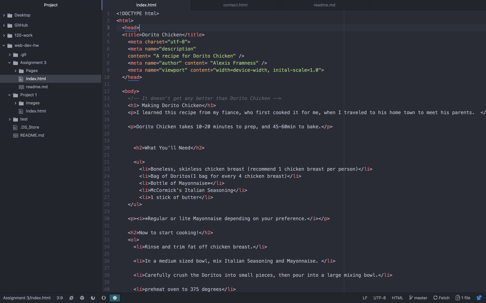

# Assignment 3

## Question B
There can only be 1 main head, and 1 main body in a webpage. The head is where information is processed, and the body is where the information being displayed on the users computer is.
## Question C
The structural markup is what is on a page. While the semantic markup is how the page should look.

## Question D
Well I had the due dates for everything written down wrong, I somehow changed out the 15th, with the 17th, in my planner, so I am a little behind this week. I basically just buckled down and plowed through the reading this week, so that I could make up for lost time.

## Screenshot of Workflow
 
