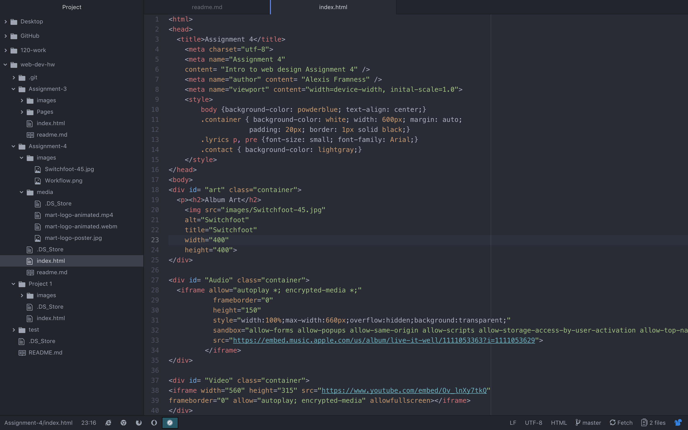

<h1>Assignment 4</h1>

<h2>Questions</h2>

## Briefly describe the difference between divs, classes, ids, and spans.
Ids are a global identifier and should be unique. Divs allows the developer to group elements together. Class is another identifier used for HTML, and can be used grouped elements together.
## What is "alt text," and why do we use it?
Describes images to someone who can't see the image. It also helps if show is a link is moved or broken.
## Summarize work cycle.
This week was fairly straight forward, I did not have any issues this week.

## Screenshot of Workflow
 
