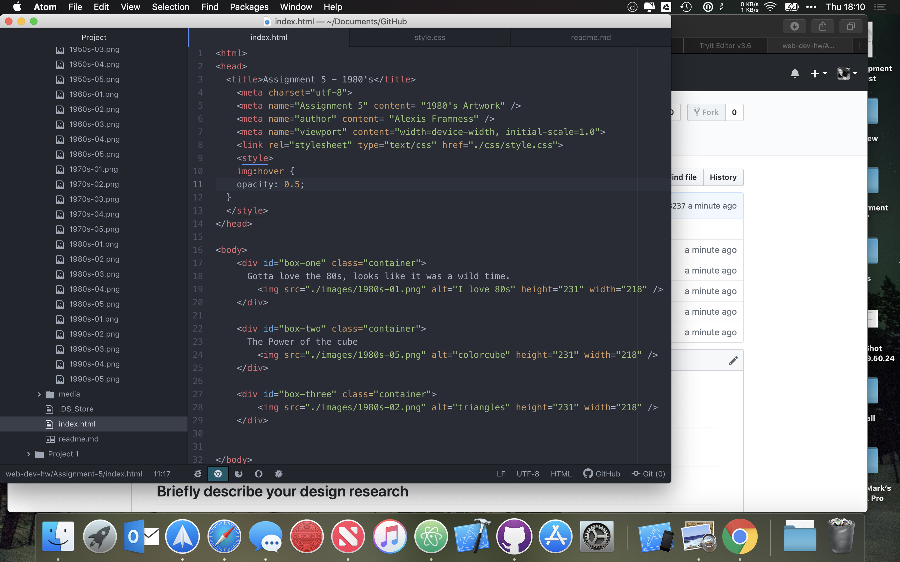

<h1>Assignment 5</h1>

<h2>Technical Report</h2>

## Briefly describe your design research
I choose to use images from the 1980s. I picked colors for the backgrounds that seems to match up with what I found used in images when I did a google search of the 1980s.
## What colors were used.
I decided to use a black background for the body of my html page, and then used pink, light blue, and gold for the colors of my div backgrounds.
## Summarize work cycle.
This week was fairly straight forward, I could not find the song in an mp3 format to embed, so I embedded a preview link from Apple Music, which is the media player I use.

## Screenshot of Workflow
 
