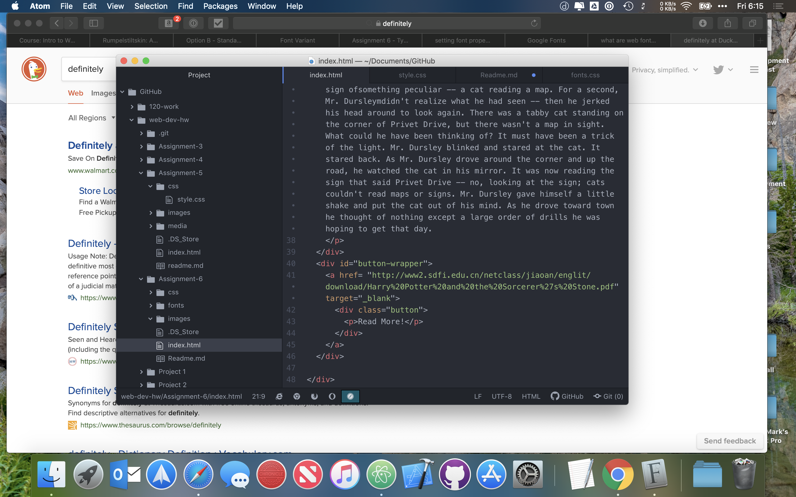

# Assignment 6
This assignment required us to take a small reading, and design it onto a basic webpage for viewing. I choose Gotham font because I think it looks cool.
## Difference in fonts
System fonts are fonts installed on the system, allowing the viewing of a specific font, on that device, without the installing of a new font.

Web Fonts are fonts hosted on a specific web server, for use when viewing content on that site. They will be downloaded to view your site.

Web Safe Fonts are good fallback fonts, that ensure maximum compatibility for viewing.

## Work Cycle
I really struggled with getting my site laid out the way I wanted it to be for this assignment, eventually due to time restraints, I had to just turn in what I had done so far.

I am definitely going to have to play around with this more to ensure I understand it properly

