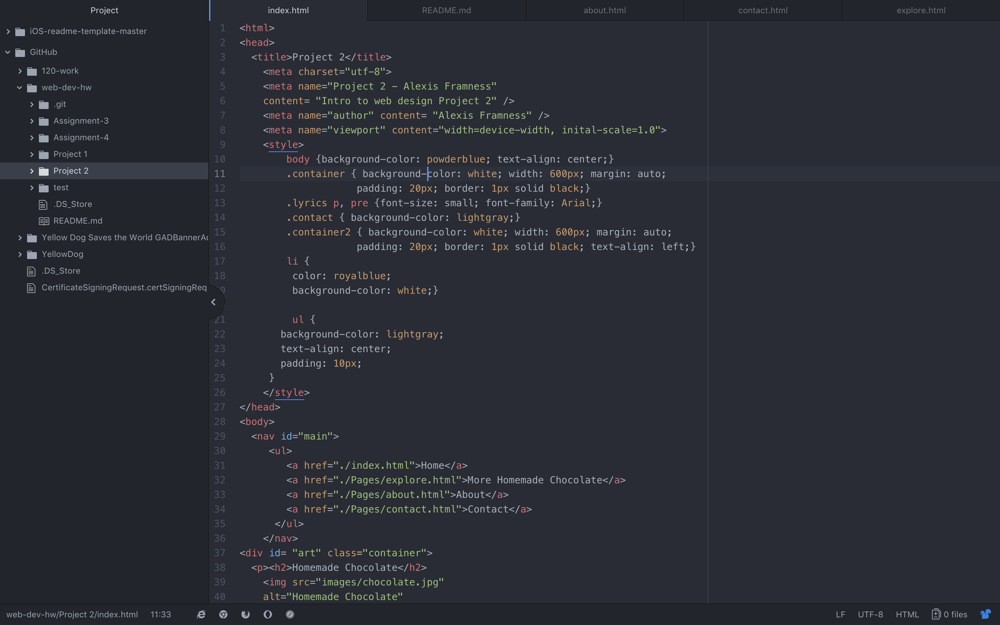

<h1>Project 2</h1>

<h2>Description of Project 2</h2>

I have really enjoyed learning HTML, I sometimes still struggle with making sure I have linked things properly, but I always manage to fix my mistake fairly quickly, remembering to add ./ in front of my file paths seems to be where I mess up.

For Project 2 we were supposed to create a 3+ page website, thats purpose is to teach someone how to make or build something. I decided on creating a website that showed people how to make homemade chocolate in under 1 hour. I also decided to include a page referencing other similar homemade chocolate options. For the website I decided to use the structure that we used from assignment 4, and make minor adjustments as I felt it necessary to do so. I put the navigation bar at the top of the page, and gave it some minor styling elements. The most time consuming part of this project was taking photos of each step of the process, so that I could have photo documentation for the website.

I also had some trouble remember iframe links, and had to refresh my memory on using those.

When it comes to using CSS for styling, I am excited to give it a try. I am hoping it will make for some fun website design.

## Screenshot of Workflow
 
