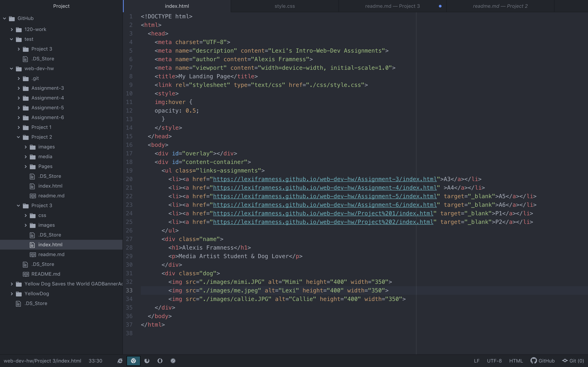

# Project 3

## What is the difference between padding, margin, and borders?
Margin is the space between the boarder and the next element, but outside of the elements.
Padding is the spacing around all 4 sides of the content inside the element. It clears the area around your content.
The boarder surrounds an element, and can be used to define the edge of your elements.

##What was the hardest task for you to accomplish this assignment? For example, was it overlapping elements, working with sizing, creating layout, or something else entirely?
The hardest part of this assignment was coming up with a layout, that I liked, I ended up recreating part of the example, because it is what I ended up liking the most.

## Summarize your work cycle for this assignment.
For this assignment, I started by picking out the content I wanted to include in my page. I then when and picked out a font using the google fonts site.

I then dropped all of my content into my index file. After placing my content in order I could begin formatting using my css page. I ran into one time consuming issue formatting my button/link to github. I had given my div an id, rather than a class, and I was trying to format the button/link using a class in my css sheet. Once I figured out that that was my issue, I was able to finish up pretty quick, which allowed me to complete my project.

